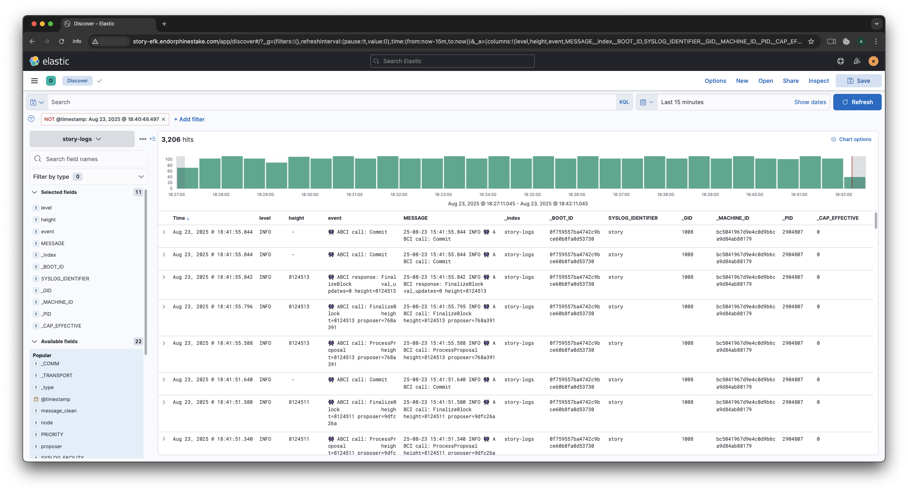

# Story Logs EFK Monitoring



> **Goal:** Step-by-step setup of centralized log collection and monitoring for **Story** nodes using Elasticsearch, Kibana, and Fluent Bit.

## Contents

1. [Requirements](#requirements)
2. [Port check & opening](#port-check--opening)
3. [Preparing servers](#preparing-servers)
4. [Installing Elasticsearch & Kibana on Server A](#installing-elasticsearch--kibana-on-server-a)
5. [Retrieving password & API key on Server A](#retrieving-password--api-key-on-server-a)
6. [Installing Fluent Bit on Server B](#installing-fluent-bit-on-server-b)
7. [Deploying Fluent Bit configurations on Server B](#deploying-fluent-bit-configurations-on-server-b)
8. [Configuring ILM and indices on Server A](#configuring-ilm-and-indices-on-server-a)
9. [Service checks & auto‑start](#service-checks--auto-start)
10. [Working with Kibana UI](#working-with-kibana-ui)
11. [Guest access to Kibana (read‑only)](#guest-access-to-kibana-read-only)
12. [Adding a new node to Fluent Bit](#adding-a-new-node-to-fluent-bit)
13. [Repository structure](#repository-structure)
14. [Contacts & contribution](#contacts--contribution)

---


## Requirements

* Two servers running **Ubuntu 20.04+** (or later):

  * **Server A**: Elasticsearch + Kibana
  * **Server B**: Fluent Bit (and Story node)
* SSH access to both servers.
* UFW (Uncomplicated Firewall) installed on each server (optional, for managing network ports).

> **Tip:** Run all commands below with `sudo` (root privileges).

## Port check & opening

1. **Check if required ports are listening (9200, 5601, 2020):**

   ```bash
   sudo ss -tuln | grep -E "9200|5601|2020"
   ```

   At this initial stage, none of these services are running yet, so it’s expected that no output is returned.

2. **Open necessary ports in the firewall (UFW):**

   ```bash
   sudo ufw allow 9200/tcp   # Elasticsearch HTTP API  
   sudo ufw allow 5601/tcp   # Kibana Web UI  
   sudo ufw allow 2020/tcp   # Fluent Bit HTTP metrics  
   sudo ufw reload
   ```

   This ensures external access to Elasticsearch (9200), Kibana (5601), and Fluent Bit’s metrics endpoint (2020).

3. **Verify firewall rules:**

   ```bash
   sudo ufw status
   ```

   You should see allow rules for **9200**, **5601**, and **2020** (if UFW is active).

## Preparing servers

1. **SSH into Server A (Elasticsearch/Kibana server):**

   ```bash
   ssh root@<IP_Server_A>
   ```

2. **SSH into Server B (Fluent Bit & Story server):**

   ```bash
   ssh root@<IP_Server_B>
   ```

3. **Update package lists and upgrade on both servers:**

   ```bash
   apt update && apt upgrade -y
   ```

   This ensures all system packages are up-to-date before installing the EFK components.

## Installing Elasticsearch & Kibana on Server A

Server A will host the logging backend: **Elasticsearch** for storage/search and **Kibana** for visualization.

### Step 1. Install Java (OpenJDK 11)

Elasticsearch requires Java. Install OpenJDK 11:

```bash
apt install -y openjdk-11-jdk
java -version    # should output version 11
```

### Step 2. Install Elasticsearch

Add Elastic’s official 7.x APT repository and install Elasticsearch:

```bash
# Import Elasticsearch GPG key and repository
curl -fsSL https://artifacts.elastic.co/GPG-KEY-elasticsearch \
  | gpg --dearmor -o /usr/share/keyrings/elastic-keyring.gpg

echo "deb [signed-by=/usr/share/keyrings/elastic-keyring.gpg] \
  https://artifacts.elastic.co/packages/7.x/apt stable main" \
  > /etc/apt/sources.list.d/elastic-7.x.list

apt update
apt install -y elasticsearch

# Enable and start the Elasticsearch service
systemctl enable elasticsearch
systemctl start elasticsearch
```

### Step 3. Configure Elasticsearch

By default Elasticsearch binds to localhost and has no security enabled. Adjust the config for our setup:

```bash
# Create config file (if not already present) and set parameters
mkdir -p /etc/elasticsearch
tee /etc/elasticsearch/elasticsearch.yml > /dev/null <<EOF
network.host: 0.0.0.0                  # listen on all interfaces
discovery.type: single-node            # single node cluster
xpack.security.enabled: true          # enable security (authentication)
xpack.security.authc.api_key.enabled: true  # enable API key auth
EOF

# Restart Elasticsearch to apply config
systemctl restart elasticsearch
```

If you encounter permissions issues on first startup (Elasticsearch may need specific directories):

```bash
mkdir -p /usr/share/elasticsearch/{logs,data}
chown -R elasticsearch:elasticsearch /usr/share/elasticsearch/logs
chown -R elasticsearch:elasticsearch /usr/share/elasticsearch/data
systemctl restart elasticsearch
systemctl status elasticsearch   
# ensure it is active/running
```

### Step 4. Install Kibana

Install Kibana from the Elastic repository:

```bash
apt update
apt install -y kibana

# Enable and start Kibana service
systemctl enable kibana
systemctl start kibana
```

### Step 5. Configure Kibana

Allow Kibana to be accessible remotely and point it to local Elasticsearch:

```bash
mkdir -p /etc/kibana
tee /etc/kibana/kibana.yml > /dev/null <<EOF
server.host: "0.0.0.0"                   # listen on all interfaces
elasticsearch.hosts: ["http://127.0.0.1:9200"]
elasticsearch.ssl.verificationMode: none  # disable SSL verification (if using HTTP)
EOF

systemctl restart kibana
```

Kibana will now be accessible via **http\://\<IP\_Server\_A>:5601**.

## Retrieving password & API key on Server A

With security enabled, Elasticsearch creates a default `elastic` superuser. We need to set its password and generate an API key for Fluent Bit to ingest logs.

### Step 6. Set the `elastic` user password

Run the interactive setup to define passwords for built-in users:

```bash
/usr/share/elasticsearch/bin/elasticsearch-setup-passwords interactive
```

Choose “Yes” when prompted, then set passwords for all users. Be sure to **note the `elastic` password** for later.

### Step 7. Generate an API key for Fluent Bit

We will use an API key (with `monitoring` privileges) for Fluent Bit to send data to Elasticsearch:

```bash
curl -u "elastic:<ELASTIC_PASS>" -X POST "http://127.0.0.1:9200/_security/api_key" \
  -H 'Content-Type: application/json' \
  -d '{ "name": "fluent-bit", "expiration": "90d" }'
```

The JSON response will contain an `id` and `api_key`. **Save these values.** (Alternatively, Fluent Bit can authenticate using the `elastic` username and password, but an API key is more secure to use in config.)

## Installing Fluent Bit on Server B

Server B will run **Fluent Bit** to read Story node logs (from systemd journal) and forward them to Elasticsearch on Server A.

### Step 8. Install Fluent Bit

Remove any old versions of Fluent Bit and install the latest version:

```bash
# Purge old installations if present
apt purge -y fluent-bit
rm -rf /etc/fluent-bit /opt/fluent-bit /var/log/fluent-bit

# Install latest Fluent Bit (official script)
curl https://raw.githubusercontent.com/fluent/fluent-bit/master/install.sh | sh

# Create a convenient symlink to the binary
ln -sf /opt/fluent-bit/bin/fluent-bit /usr/local/bin/fluent-bit

# Verify installation
fluent-bit --version
```

## Deploying Fluent Bit configurations on Server B

Now we configure Fluent Bit with the appropriate inputs (to read Story logs), filters, and outputs.

### Step 9. Prepare configuration directories

Create directories to organize Fluent Bit config files:

```bash
mkdir -p /etc/fluent-bit/{inputs,filters,outputs,scripts}
```

### Step 10. Main Fluent Bit config: `/etc/fluent-bit/fluent-bit.conf`

Create the primary configuration file that includes sub-configs:

```bash
tee /etc/fluent-bit/fluent-bit.conf > /dev/null << 'EOF'
[SERVICE]
    flush           1
    daemon          off
    log_level       debug
    http_server     on
    http_listen     0.0.0.0
    http_port       2020
    storage.metrics on

@INCLUDE inputs/*.conf
@INCLUDE filters/*.conf
@INCLUDE outputs/*.conf
EOF
```

This sets up Fluent Bit to flush logs every 1 second, run in the foreground (for debugging), and enables the built-in HTTP server on port 2020 for metrics. It then includes all config fragments from the inputs, filters, and outputs directories.

### Step 11. **Input**: Story logs (consensus client) → `/etc/fluent-bit/inputs/story.conf`

```bash
tee /etc/fluent-bit/inputs/story.conf > /dev/null << 'EOF'
[INPUT]
    name              systemd
    systemd_filter    _SYSTEMD_UNIT=story.service
    read_from_tail    on
    Tag               story
EOF
```

This input plugin will read from the systemd journal for the `story.service` (Story node). It filters logs for that unit and tags them as **`story`**.
The `Read_From_Tail on` ensures we start reading new logs (tail) rather than all historical logs.

### Step 12. **Input**: Geth logs (execution client) → `/etc/fluent-bit/inputs/story-geth.conf`

```bash
tee /etc/fluent-bit/inputs/story-geth.conf > /dev/null << 'EOF'
[INPUT]
    name              systemd
    systemd_filter    _SYSTEMD_UNIT=story-geth.service
    read_from_tail    on
    tag               story-geth
EOF
```

This input pulls logs from the `story-geth.service` (Story Geth node), tagging them as **`story-geth`**.

### Step 13. **Filter**: Lua parser for log content → `/etc/fluent-bit/filters/lua.conf`

We use a Lua script to clean and parse the log messages, extracting structured fields (like level, event, etc.):

```bash
tee /etc/fluent-bit/filters/lua.conf > /dev/null << 'EOF'
[FILTER]
    name        lua
    match       *
    script      /etc/fluent-bit/scripts/parse_message.lua
    call        cb_clean_and_split
EOF
```

This Lua filter will apply to all logs (`Match *`). It invokes the function `cb_clean_and_split` from our Lua script (we'll create next) on each record.

### Step 14. **Output**: Elasticsearch (two indices) → `/etc/fluent-bit/outputs/es.conf`

Configure two outputs to Elasticsearch — one for each type of Story node logs (consensus and execution). Both outputs point to the Elasticsearch host (Server A):

```bash
tee /etc/fluent-bit/outputs/es.conf > /dev/null << 'EOF'
[OUTPUT]
    name                es
    match               story
    host                <ES_HOST>        # Server A IP or hostname
    port                9200
    http_user           elastic
    http_passwd         <ELASTIC_PASS_OR_API_KEY>
    logstash_format     off
    index               story-logs
    include_Tag_Key     on
    tag_Key             node
    suppress_Type_Name  on
    type                _doc
    time_Key            @timestamp
    trace_Output        on
    trace_Error         on

[OUTPUT]
    name                es
    match               story-geth
    host                <ES_HOST>
    port                9200
    http_user           elastic
    http_passwd         <ELASTIC_PASS_OR_API_KEY>
    logstash_format     off
    index               story-geth-logs
    include_tag_key     on
    Tag_Key             node
    suppress_type_name  on
    type                _doc
    time_key            @timestamp
    trace_output        on
    trace_error         on
EOF
```

Replace `<ES_HOST>` with the address of Server A (Elasticsearch). For authentication, you can use `elastic` as user and the password you set (`<ELASTIC_PASS>`), **or** username `elastic` and the base64 API key (`<id>:<api_key>` string) as the password. The config above uses basic auth for simplicity.

Key points in this output config:

* We create two indices: **`story-logs`** and **`story-geth-logs`**, corresponding to consensus node and execution node logs respectively.
* `Include_Tag_Key on` and `Tag_Key node` will include the Fluent Bit tag (e.g., `story` or `story-geth`) as a field named `node` in each log document. This helps identify the source service in Elasticsearch.
* `Trace_Output on` and `Trace_Error on` are enabled for debugging; they can be turned off in production if not needed.

### Step 15. **Lua script** for parsing log messages → `/etc/fluent-bit/scripts/parse_message.lua`

Now create the Lua script referenced by the filter, to clean ANSI escape codes and parse key fields from the log message:

```bash
tee /etc/fluent-bit/scripts/parse_message.lua > /dev/null << 'EOF'
-- Lua log parsing script for Story node logs
function cb_clean_and_split(tag, ts, record)
    local msg = record["MESSAGE"] or ""
    -- Remove ANSI color codes (e.g., from logs output)
    msg = msg:gsub("\27%[[0-9;]*m", "")
    record["message_clean"] = msg
    -- Parse out key=value pairs in the message (if any) and add them as fields
    for k, v in msg:gmatch("([%w_]+)=([%w%p]+)") do
        record[k] = v
    end
    -- Extract time (if present, e.g., "12:34PM")
    record["time"] = msg:match("(%d+:%d+%a%a)")
    -- Extract log level (e.g., INFO, ERROR, DEBUG)
    record["level"] = msg:match("%s(%u+)%s")
    -- Extract event/message summary after the level 
    record["event"] = msg:match("%u+%s(.+)")
    -- Tag the log source (node type or identifier)
    record["node"] = "story"
    return 1, ts, record
end
EOF
```

This script will enrich each log record with:

* `message_clean`: the log message without any terminal color codes.
* `time`: a timestamp string if found in the message (Story logs might include a time in the message itself).
* `level`: the log level (INFO, WARN, ERROR, etc.).
* `event`: a short description of the event or action logged.
* `node`: a fixed identifier `"story"` (which you can customize or remove if you prefer to rely on the `node` field from the tag).

*(The pattern matching may need adjustment depending on Story’s exact log format, but this serves as a generic approach.)*

## Configuring ILM and indices on Server A

Next, configure Elasticsearch Index Lifecycle Management (ILM) and index templates for our Story log indices. This will allow logs to rollover daily (or when reaching a certain size), and delete old indices after a retention period.

Perform these steps in Kibana’s **Dev Tools** console or via the Elasticsearch API (using curl):

### Step 16. Create an ILM policy

Create a lifecycle policy named **`story-logs-policy`** that rolls over indices daily or at 1 GB, and deletes indices older than 7 days:

```json
curl -u $ES_USER:$ES_PASS -X PUT "$ES_HOST/_ilm/policy/story-logs-policy" -H 'Content-Type: application/json' -d '
{
  "policy": {
    "phases": {
      "hot": {
        "min_age": "0ms",
        "actions": {
          "set_priority": { "priority": 100 },
          "rollover": { "max_size": "1gb", "max_age": "1d" }
        }
      },
      "delete": {
        "min_age": "7d",
        "actions": {
          "delete": { "delete_searchable_snapshot": true }
        }
      }
    }
  }
}'
```

This policy will rollover to a new index when an index grows beyond 1 GB or ages beyond 1 day (whichever comes first), and will delete indices older than 7 days.

### Step 17. Create index templates for Story logs

Create index templates for the two indices (`story-logs` and `story-geth-logs`) so that new indices use our ILM policy and appropriate settings:

```json
curl -u $ES_USER:$ES_PASS -X PUT "$ES_HOST/_index_template/story-logs-template" -H 'Content-Type: application/json' -d '
{
  "index_patterns": ["story-logs-*"],
  "template": {
    "settings": {
      "index": {
        "lifecycle": {
          "name": "story-logs-policy",
          "rollover_alias": "story-logs"
        },
        "number_of_shards": 1,
        "number_of_replicas": 0
      }
    }
  }
}'

curl -u $ES_USER:$ES_PASS -X PUT "$ES_HOST/_index_template/story-geth-logs-template" -H 'Content-Type: application/json' -d '
{
  "index_patterns": ["story-geth-logs-*"],
  "template": {
    "settings": {
      "index": {
        "lifecycle": {
          "name": "story-geth-logs-policy",
          "rollover_alias": "story-geth-logs"
        },
        "number_of_shards": 1,
        "number_of_replicas": 0
      }
    }
  }
}'
```

These templates ensure any index matching `story-logs-*` or `story-geth-logs-*` will use the lifecycle policy and have 1 shard, 0 replicas (since we likely have a single-node cluster for logs).

### Step 18. Create initial indices with write aliases

Bootstrap the initial indices for each log type and assign the write alias:

```json
curl -u $ES_USER:$ES_PASS -X PUT "$ES_HOST/story-logs-000001" -H 'Content-Type: application/json' -d '
{
  "aliases": {
    "story-logs": { "is_write_index": true }
  }
}'

curl -u $ES_USER:$ES_PASS -X PUT "$ES_HOST/story-geth-logs-000001" -H 'Content-Type: application/json' -d '
{
  "aliases": {
    "story-geth": { "is_write_index": true }
  }
}'
```

This creates `story-logs-000001` and `story-geth-logs-000001` as the first indices and sets the aliases `story-logs` and `story-geth-logs` to point to them for incoming writes. Elasticsearch will then roll over to `...000002` when conditions are met (per the ILM policy).

*If any indices without the numbering (like old test indices) exist with the same alias, you may need to delete them or adjust aliases to avoid conflicts.*

## Service checks & auto-start

With everything configured, let’s verify all services are running and set up auto-start for Fluent Bit.

### Step 19. Verify Elasticsearch & Kibana status

on **Server A**:

```bash
systemctl status elasticsearch
systemctl status kibana
```

Both should be active (running). You can also check the cluster health:

```bash
curl -u elastic:<ELASTIC_PASS> "http://127.0.0.1:9200/_cluster/health?pretty"
```

Expect to see `"status" : "green"` indicating the single-node cluster is healthy.

### Step 20. Enable Fluent Bit as a service on Server B

Create a systemd service unit for Fluent Bit to start on boot and manage it easily:

```bash
tee /etc/systemd/system/fluent-bit.service > /dev/null <<EOF
[Unit]
Description=Fluent Bit service
After=network.target

[Service]
Type=simple
ExecStart=/opt/fluent-bit/bin/fluent-bit -c /etc/fluent-bit/fluent-bit.conf
Restart=always

[Install]
WantedBy=multi-user.target
EOF

# Reload systemd to pick up the new service, enable and start it
systemctl daemon-reload
systemctl enable fluent-bit
systemctl start fluent-bit
systemctl status fluent-bit
```

`status` should show Fluent Bit as active. If there are any errors, check the logs with `journalctl -u fluent-bit -f` for troubleshooting (the `Trace_Output on` in our config will make Fluent Bit log details of its Elasticsearch communications).

Now confirm that logs are being indexed in Elasticsearch:

```bash
# on Server B or A, use curl to check indices in Elasticsearch:
curl -u elastic:<ELASTIC_PASS> "http://<ES_HOST>:9200/_cat/indices?v"
```

You should see indices like **`story-logs-000001`** and **`story-geth-logs-000001`** listed (with some document count if logs have been generated by the Celestia services).

## Working with Kibana UI

With data flowing into Elasticsearch, use Kibana to explore and visualize the logs.

### Step 21. Create a Data View for Story logs

In Kibana (navigate to **http\://\<IP\_Server\_A>:5601** in your browser and log in with the `elastic` credentials):

* Go to **Stack Management → Data Views** (in Kibana v7 this may be under Kibana Index Patterns).
* Click “Create data view” (or "Create index pattern" in older versions).
* For the index pattern, enter **`story-logs-*`** – this will include both `story-logs-*` and `story-geth-logs-*` indices.
* Select `@timestamp` as the time field (Fluent Bit will assign `@timestamp` when sending to Elasticsearch).
* Save the data view (name it e.g. "Story Logs").

### Step 22. Discover logs in Kibana

Go to **Discover** in Kibana and select the new "Story Logs" data view. Adjust the time filter to "Last 15 minutes" (or an appropriate range where you know logs exist).

You should see incoming log entries. The fields parsed by our Fluent Bit setup (on the left side in Kibana) include:

* `message_clean`: the clean log message.
* `level`: log level (e.g., INFO, ERROR).
* `event`: a short description parsed from the message.
* `node`: the source tag (e.g., `story` or `story-geth`), as well as the fixed field we set ("story-node").

Use Kibana’s filtering and search to refine the view:

* For example, click on a `level` value (such as **ERROR**) and filter to see only error logs.
* Use the search bar to find logs with specific keywords or events.

### Step 23. Create Visualizations (Kibana Lens example)

You can build visualizations to monitor log trends. For instance, to visualize the count of logs by level:

* Go to **Visualize Library → Create visualization → Lens**.
* Choose the "Story Logs" data view.
* Drag **`Count of records`** to the visualization (Y-axis).
* Drag the **`level`** field to the X-axis (Kibana will show a bar per level).
* (Optional) Drag **`node`** field to the "Break down by" to split by node type (bridge vs full node) in the same chart.
* Customize as needed, then save the visualization (e.g., "Logs by Level").

You can create similar visualizations, such as:

* Logs over time (timestamp histogram).
* Number of ERROR/WARN logs per node.
* etc.

### Step 24. Build a Dashboard

Combine visualizations and log tables on a dashboard for an overview:

* Go to **Dashboard → Create dashboard**.
* Click **Add** and include the visualizations you've created (e.g., "Logs by Level") and you can also add a saved search from Discover for raw logs.
* Arrange and resize the panels for a clear view.
* Save the dashboard (e.g., name it **“Story-Logs Monitoring”**).
* Enable auto-refresh (e.g., every 5 or 10 seconds) for real-time updating of logs on the dashboard.

This dashboard can now serve as a monitoring pane for your Story node logs.

## Guest access to Kibana (read‑only)

If you want to share the Kibana dashboard publicly (read-only), you can set up an **anonymous user** in Kibana/Elasticsearch. This allows anyone to view the dashboard without login.

For example, a demo instance is available here:
👉 **Demo (Read-Only):** [https://story-loglume.endorphinestake.com](https://story-loglume.endorphinestake.com/app/dashboards#/view/de3635b8-6896-4d58-8a56-a91c05e4df0d?_g=(filters:!(),refreshInterval:(pause:!t,value:60000),time:(from:now-15m,to:now)))

To enable anonymous read-only access on your Kibana:

### 1. Create a `kibana_guest` user (in Elasticsearch)

Use the security API to create a user with a password and assign it a role we'll define for anonymous access:

```bash
curl -X POST -u elastic:<ELASTIC_PASS> "http://localhost:9200/_security/user/kibana_guest" \
-H 'Content-Type: application/json' -d '
{
  "password" : "guest_pass",
  "roles"    : [ "anonymous_role" ],
  "full_name": "Guest Kibana User"
}'
```

This creates a user `kibana_guest` with password `guest_pass` and assigns it a role `anonymous_role`.

### 2. Create an `anonymous_role` with read-only privileges

Now define the `anonymous_role` in Kibana (through the Kibana API, since it involves Kibana privileges):

```bash
curl -X PUT "http://localhost:5601/api/security/role/anonymous_role" \
-H "Content-Type: application/json" -H "kbn-xsrf: true" \
-u elastic:<ELASTIC_PASS> -d '{
  "elasticsearch": {
    "cluster": [],
    "indices": [
      {
        "names": [ "*" ],
        "privileges": [ "read", "view_index_metadata" ]
      }
    ]
  },
  "kibana": [
    {
      "base": [ "read" ],
      "feature": {
        "discover": [ "read" ],
        "dashboard": [ "read" ]
      },
      "spaces": [ "default" ]
    }
  ]
}'
```

This role grants:

* In Elasticsearch: read access to all indices (you can restrict this to just `story-logs-*` patterns if desired).
* In Kibana: read access to Discover and Dashboard features in the default space.

### 3. Update Elasticsearch and Kibana configs for anonymous access

Edit the Elasticsearch and Kibana config files on Server A:

**In `/etc/elasticsearch/elasticsearch.yml`**, add:

```yaml
xpack.security.authc:
  anonymous:
    username: kibana_guest
    roles: ["anonymous_role"]
    authz_exception: false
```

This tells Elasticsearch that an anonymous user (no auth provided) should be treated as `kibana_guest` with role `anonymous_role`.

**In `/etc/kibana/kibana.yml`**, add or update:

```yaml
server.publicBaseUrl: "http://<your_kibana_domain_or_IP>:5601"

xpack.security.authc.providers:
  anonymous.anonymous1:
    order: 0
  basic.basic1:
    order: 1
```

Replace `<your_kibana_domain_or_IP>` with the URL where users will access Kibana. Enabling the anonymous provider ensures Kibana will automatically log people in as the anonymous user.

Now restart both services to apply changes:

```bash
systemctl restart elasticsearch
systemctl restart kibana
```

Result: Anyone visiting your Kibana URL will be logged in as the read-only `kibana_guest` user. They can view the Discover page and Dashboard we set up, but cannot modify anything.

> **Note:** Be cautious with anonymous access on a public Kibana. Limit privileges appropriately and consider IP whitelisting if needed.

---

## Adding a new node to Fluent Bit

If you want to collect logs from an additional node or service:

* **Create a new input config** in `/etc/fluent-bit/inputs/` for the service’s systemd unit. Use a unique `Tag`. For example, for a light node you might create `light.conf` with `Systemd_Filter _SYSTEMD_UNIT=light.service` and `Tag light`.
* **Add a corresponding output** in `/etc/fluent-bit/outputs/es.conf` for that tag, pointing to a new index (e.g., `light-logs`). Copy the format of the existing outputs, changing `Match` and `Index` accordingly.
* Decide if the new logs can reuse the same ILM policy or if you need a separate policy. You can likely reuse `story-logs-policy` by creating a new index template for the new index pattern (if using a different prefix).
* **Update the Lua filter** (if necessary). Our Lua script is generic, so it should handle any similar log format. You might want to adjust the static `record["node"]` assignment to differentiate nodes, or simply rely on the `node` field added via the tag.
* **Restart Fluent Bit** to apply changes:

  ```bash
  systemctl restart fluent-bit
  ```

The new node’s logs should start flowing into the specified Elasticsearch index. Don’t forget to update your Kibana Data View (if using a broad pattern like `story-logs-*`, it will automatically include the new index if it matches the pattern).

## Repository structure

For reference, a summary of the configuration file structure on Server B (Fluent Bit):

```plaintext
/etc/fluent-bit/
├── fluent-bit.conf                   # Main Fluent Bit config (includes others)
├── inputs/
│   ├── story.conf                     # Input for story.service logs
│   └── story-geth.conf                   # Input for story-geth.service logs
├── filters/
│   └── lua.conf                      # Lua filter configuration
├── outputs/
│   └── es.conf                       # Outputs to Elasticsearch (full and bridge indices)
└── scripts/
    └── parse_message.lua             # Lua script to parse log messages
```

You can maintain these files in a Git repository for version control. Adjust configurations or add new input/output files as your infrastructure grows.

## Contacts & contribution

For any issues, questions, or contributions to this logging setup guide, please reach out or open an issue/PR in the corresponding repository. Community contributions are welcome to keep the guide up-to-date with Celestia’s developments and to add support for additional use-cases or refinements.

[](LICENSE)


